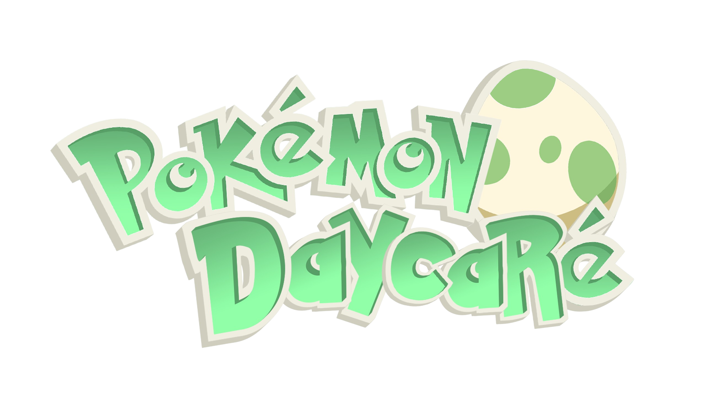
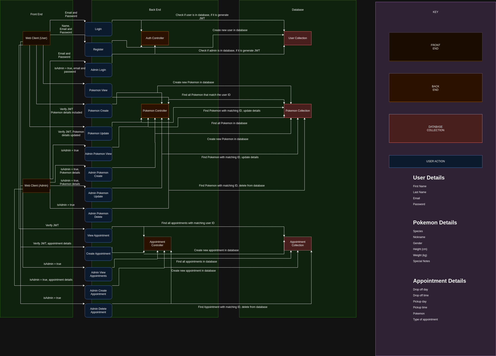
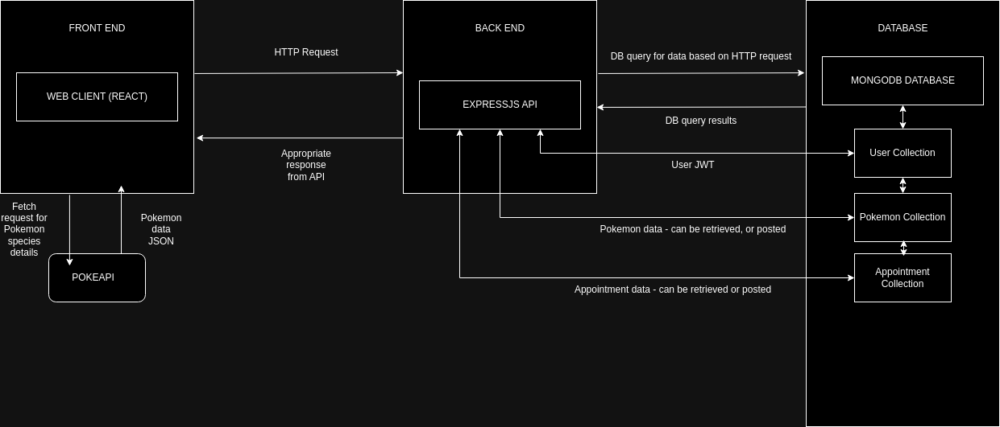
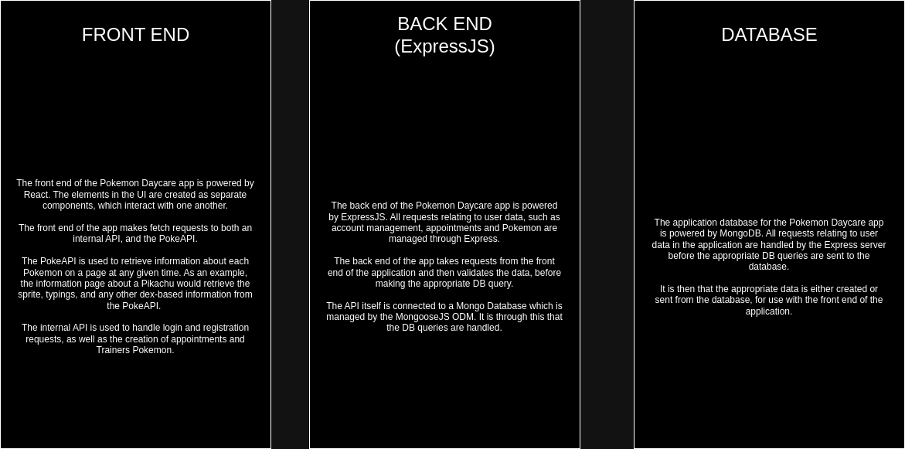
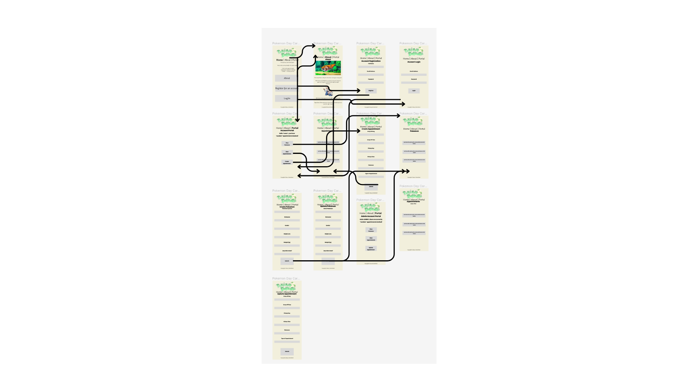
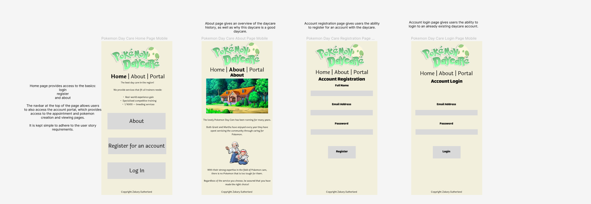
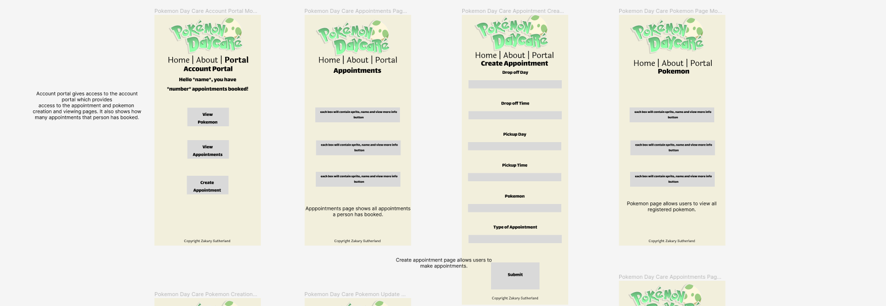
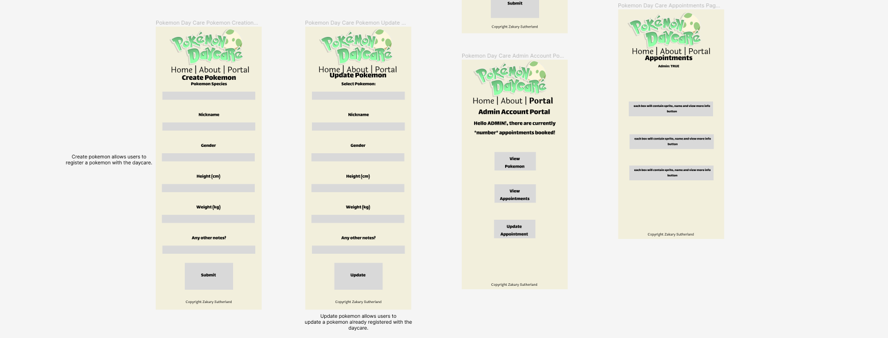
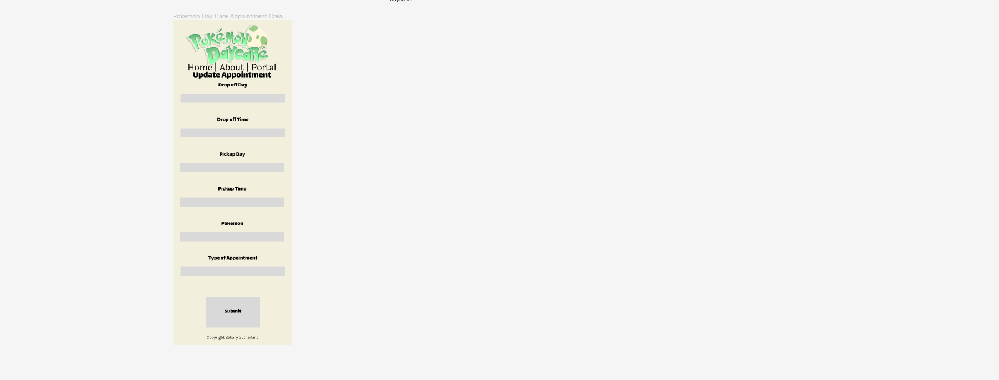
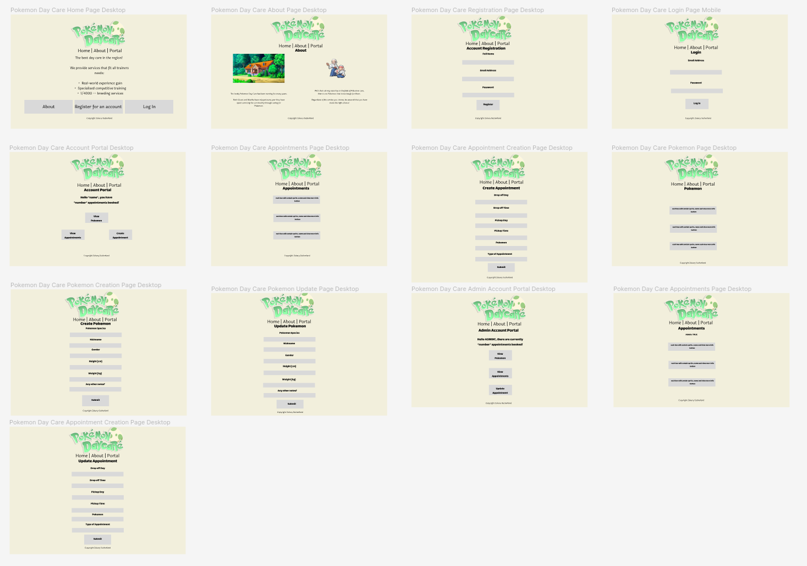

Logo credit to my good friend, [Lochy.](https://www.linkedin.com/in/lochlyn-thomas-045b55289/)

### R1 - Description of Website

#### Purpose

Everyone knows the Pokemon daycare. Whether you were too lazy to farm exp, were trying to breed that perfect competitive mon, or just wanted to hatch a shiny - the daycare has always been there to help make that possible. 

Running a day care is hard work, however! Day cares are often run by older couples, and it can be easy to get lost amongst what is actually in the daycare at any given time, and who each Pokemon belongs to. It is also important for the Pokemon to be treated correctly, whether that be through training or being paired with the right partner.

Having this site will allow the daycare to properly manage the business, and ensure that their operations are held to a high standard.

Until now, daycare operations have been managed by other methods, that are harder to keep organised, such as a physical file system. Having an online booking system means that data is stored in the cloud, and can be accessible by multiple people, across multiple locations. 

The couple that runs this daycare is already quite happy with the idea of an online portal, as it is one less physical item that they have to worry about - everything is in the same place, and is easily accessible.

#### Features

This app can be used by both daycare owners and trainers:

Trainers:

Trainers can use the Day Care website to create appointments for their Pokemon. In these appointments, trainers can: 

- Can set drop off and pick-up times for the Pokemon they want to send to the daycare.

This will allow trainers to plan ahead. Knowing that their spot is secured can take the stress off of the trainer, as they now know that they have a place for their Pokemon to go.

- Can select the type of the appointment: training, breeding, etc.

This will allow the trainers to outline what the purpose of the Day Care appointment is, allowing the Day Care owners to prepare properly for the appointment.

- Can select the Pokemon they would like to drop off - include details like nickname, gender, etc.

Trainers will first add their Pokemon to the website, and establish important details such as their nickname, gender, weight, height, and any other important details that there are to be considered.

- Can see Pokemon they currently have in the daycare

Trainers will be able to view all currently active, and upcoming appointments.

(Maybe): - See updates posted by the daycare owner about how their pokemon is doing. Is there an egg? Etc.

This will allow trainers to feel more connected with their Pokemon while they are away.

Daycare Owners: (admin)

- Can view all currently booked appointments

This will allow the Day Care owners to prepare properly for any given day.

- Can view details about the booked Pokemon

Knowing of any special details or requirements is important, and this feature allows the Day Care owners to do that.

- Can cancel appointments

Being able to cancel - if the Day Care owners deem the appointment to be inappropriate, any hassle can be avoided with this feature.

- Can update appointments

- At the request of a trainer, or at their own discretion, the Day Care owners will be able to update any details of the appointment, as required.

(Maybe): - Post updates about how a Pokemon is doing.

- This will ensure that trainers feel at ease about their Pokemon being at the Day Care.

#### Target Audience

The target audience for this application is for trainers that are looking for a daycare that offers services for:

- Offhand training, for their Pokemon to gain real-world experience.
- Competitive breeding, for those who would like specialised offspring to fit certain attributes.
- Regular care, for those who are going away or have other commitments.
- shiny hunters, for those that want a unique Pokemon that stands out.

#### Tech Stack

This application will make use of the MERN stack for development.

Front-End: HTML5, CSS3, JavaScript, React
Back-End: Node, ExpressJS, MongoDB, Mongoose

Deployment: Netlify, Heroku

Testing: Jest, Cypress

Project Management: Trello

Other: Draw.io, Figma, GitHub, Visual Studio Code

#### Project Planning

I decided to complete the project in the following order:

- Planning 

- Backend

- Frontend

Though, I did not set any specific deadlines in the case that I finished one part earlier than expected, and wanted to continue on with the project.

### R2 - Dataflow Diagram

### R3 - Application Architecture Diagram

### R4 - User Stories

#### <u>Trainers</u>

#### <u>Daycare Owners</u>

#### R4.5 - Revised User Stories

These user stories were revised to include more detail, and to remove mentions of adding photo status updates of Pokemon for trainers. This was done to ensure that the project would be able to be completed on time.

#### <u>Daycare Owners</u>

### R5 - Wireframes

[Link to wireframes](https://www.figma.com/file/8kr6b62xQQqS0WMp4OFXzH/Pokemon-Day-Care-Wireframes?type=design&node-id=0%3A1&mode=design&t=XrqvTIykM2bgoXxX-1)

[Draft Wireframe PDF](./Draft%20Pokemon%20Day%20Care%20Wireframes.pdf)

[Updated Wireframe PDF](./Pokemon%20Day%20Care%20Wireframes.pdf)

### R6 - Trello Screenshots
#### [Trello Link](https://trello.com/b/Ddg1XJ34/t3a2-full-stack-app)

#### 13th November - Initial Creation of Trello

#### 14th November - Progress Update

#### 20th November - Progress Update and began adding frontend and backend tasks

#### 27th November - Trello Board at end of planning phase
